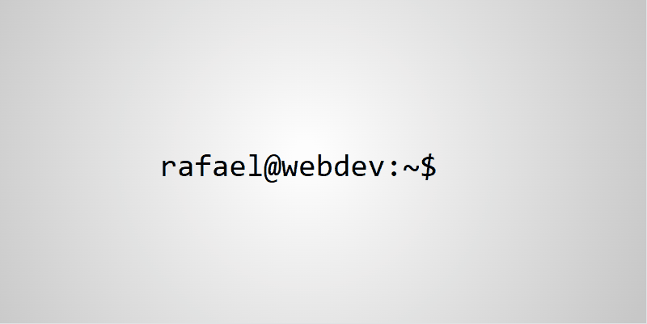

# 🌐 rafaelmaciels/v1  

Este repositório guarda a **primeira e até então única versão** do meu site pessoal, criado em **2016** e mantido no ar desde então.  

Em **janeiro de 2026**, decidi finalmente construir um site pessoal mais profissional, mas mantive esta versão em um **subdomínio** para que, além da lembrança, ela sirva como um verdadeiro **registro histórico** da minha trajetória digital.  

---

## ✨ Sobre esta versão
- Criada em 2016, com simplicidade e autenticidade.  
- Representa o início da minha presença online.  
- Mantida como parte da minha história e evolução.  

---

## 🎥 Demonstração

Aqui você pode ver como era o site em funcionamento:  

  
  

---

## 🚀 Nova fase
Agora sigo com um site mais moderno e profissional, mas este projeto continua disponível como **marco** da minha jornada.  

---

📌 *Este repositório é mais do que código: é memória, é identidade, é o ponto de partida.*
